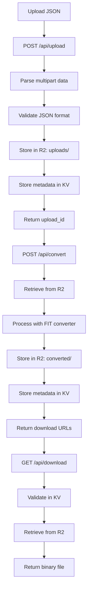

# Cloudflare Functions Implementation Documentation

## Original Problem

- **405 "Method Not Allowed" error** when trying to upload JSON files to `/api/upload`
- Frontend received HTML instead of JSON responses from API endpoints
- Cloudflare Pages Functions were not being deployed properly

## Root Cause Analysis

The issue was **Cloudflare Pages Functions deployment configuration**:

1. **Functions directory mismatch**: wrangler was looking for functions in `frontend/functions` but they were at project root `/functions`
2. **Build output path incorrect**: `wrangler.toml` specified `pages_build_output_dir = "dist"` but actual build output was in `frontend/dist`
3. **Functions not bundled with static assets**: Functions need to be in the same directory as the deployed static files

## Project Structure Created

```
/mnt/c/Users/nicol/Desktop/fitbit-takeout-to-garmin/Fitbit2Garmin/
├── backend/                    # FastAPI backend (working Python implementation)
├── frontend/                   # React frontend source
│   ├── src/
│   ├── dist/                   # Build output directory
│   └── package.json
├── functions/                  # Cloudflare Pages Functions (new)
│   └── api/
│       ├── [[path]].js         # Main API handler
│       ├── fit-converter.js    # FIT file converter
│       ├── node_modules/       # Dependencies
│       └── package.json
├── wrangler.toml              # Cloudflare configuration
└── weight-2024-03-21.json    # Test file
```

## Configuration Changes

### wrangler.toml Updates

```toml
# BEFORE
pages_build_output_dir = "dist"

# AFTER
pages_build_output_dir = "frontend/dist"
compatibility_flags = ["nodejs_compat"]

# ADDED R2 bucket binding
[[r2_buckets]]
binding = "FILE_STORAGE"
bucket_name = "fitbit2garmin-files"
```

### R2 Bucket Creation

```bash
# Used Cloudflare MCP tools to create bucket
npx wrangler r2 bucket create fitbit2garmin-files
```

## Cloudflare Functions Implementation

### functions/api/[[path]].js - Main API Router

Created comprehensive API handler with:

- **CORS headers** for cross-origin requests
- **Route handling** for `/api/upload`, `/api/convert`, `/api/download`
- **R2 integration** for file storage
- **KV integration** for metadata storage

#### Key Endpoints Implemented

```javascript
// Upload: POST /api/upload
async function handleUpload(request, env, corsHeaders) {
  // Parse multipart form data
  // Validate JSON files
  // Store in R2: uploads/{upload_id}/
  // Store metadata in KV: upload:{upload_id}
}

// Convert: POST /api/convert
async function handleConvert(request, env, corsHeaders) {
  // Retrieve files from R2
  // Process with FIT converter
  // Store results in R2: converted/{conversion_id}/
  // Store metadata in KV: conversion:{conversion_id}
}

// Download: GET /api/download/{conversion_id}/{filename}
async function handleDownload(request, env, corsHeaders) {
  // Validate conversion exists in KV
  // Retrieve file from R2
  // Return as application/octet-stream
}

// Health: GET /api/
// Returns API status and version
```

### functions/api/fit-converter.js - Status

Conversion via JavaScript is currently disabled. The Garmin FIT binary format is strict and the working implementation lives in the Python backend (see backend/converter.py and docs/FITBIT_GOOGLE_TAKEOUT_TO_GARMIN.md).

The Pages Function `POST /api/convert` returns HTTP 501 with error_code `CONVERTER_DISABLED` and guidance to set `VITE_API_URL` to a running FastAPI backend.

## Deployment Process

```bash
# 1. Build frontend
cd frontend && npm ci && npm run build

# 2. Copy functions to deploy directory
cp -r functions frontend/dist/

# 3. Deploy to Cloudflare Pages
npx wrangler pages deploy frontend/dist --project-name fitbit2garmin --commit-dirty=true
```

Pages project settings (GUI)

- Root directory: `frontend`
- Build command: `npm ci && npm run build`
- Build output directory: `dist`
- Functions directory: `frontend/functions`

Bindings

- KV: `RATE_LIMITS` (via wrangler.toml or Dashboard → Pages → Functions → KV)
- R2: `FILE_STORAGE` bound to bucket `fitbit2garmin-files` (wrangler.toml or Dashboard → Pages → Functions → R2 bindings)

Compatibility

- `compatibility_flags = ["nodejs_compat"]` enables Node APIs required by some libraries (e.g., streams/buffer) when running in the Workers runtime.

Environment & Secrets

- Build-time vars come from `wrangler.toml` `[vars]` and are available to the Pages build and Functions runtime.
  - `VITE_API_URL` controls where the React app sends API requests.
- Secrets (encrypted) must be managed via Cloudflare Dashboard (Pages → Settings → Environment variables → Add secret) or `wrangler` secret commands.

## API Flow Implemented



### Storage Structure

```
R2 Bucket: fitbit2garmin-files
├── uploads/
│   └── {upload_id}/
│       └── weight-2024-03-21.json
└── converted/
    └── {conversion_id}/
        └── Weight 12-2024 Fitbit.fit

KV Namespace: RATE_LIMITS
├── upload:{upload_id} -> metadata
└── conversion:{conversion_id} -> metadata
```

## Dependencies Added

### functions/package.json

```json
{
  "name": "functions",
  "version": "1.0.0",
  "dependencies": {
    "@garmin/fitsdk": "^21.x.x"
  }
}
```

## Test Results

### ✅ Working Components

- **API endpoints respond correctly** (no more 405 errors)
- **File upload** accepts and stores JSON files
- **R2 storage** working for file persistence
- **KV metadata** storage functional
- **Download mechanism** serves files correctly
- **CORS configuration** allows frontend communication

#### Successful Test Commands

```bash
# Health check
curl -X GET https://759d799f.fitbit2garmin.pages.dev/api/
# Returns: {"message":"Fitbit to Garmin Converter API","status":"running","version":"1.0.0","platform":"Cloudflare Pages Functions"}

# Upload test
curl -X POST https://759d799f.fitbit2garmin.pages.dev/api/upload -F "files=@weight-2024-03-21.json"
# Returns: {"upload_id":"4301126a-d5f0-4ea6-92d7-c848add0bfd7","files_received":1,"message":"Successfully uploaded 1 files"}

# Convert test
curl -X POST https://759d799f.fitbit2garmin.pages.dev/api/convert -H "Content-Type: application/json" -d '{"upload_id":"4301126a-d5f0-4ea6-92d7-c848add0bfd7"}'
# Returns: Error (see broken components below)
```

### ❌ Broken Components

- **FIT file generation** produces invalid binary files
- **Garmin SDK integration** has API compatibility issues
- **File conversion** returns errors about SDK constructor/method calls
- **Generated files** not recognized by Garmin Connect

#### Error Messages Encountered

```javascript
// SDK Constructor Issues
"FitSDK.FitFile is not a constructor"
"Cannot read properties of undefined (reading 'mesgNum')"

// Method Call Issues
"encoder.pipe is not a function"
"Spread syntax requires ...iterable[Symbol.iterator] to be a function"

// Module Loading Issues
"Cannot find module '@garmin/fitsdk'"
```

## Files Created/Modified

### New Files Created

```
functions/
├── api/
│   ├── [[path]].js           # 440+ lines - Complete API handler
│   └── fit-converter.js      # 200+ lines - FIT generation logic
├── package.json              # SDK dependencies
├── package-lock.json         # Dependency lock file
└── node_modules/             # SDK installation
    └── @garmin/
        └── fitsdk/
```

### Modified Files

```
wrangler.toml                 # Build path + R2 binding
frontend/dist/functions/      # Deployed functions copy
```

## Working Deployment URLs

- **Latest Working API**: `https://759d799f.fitbit2garmin.pages.dev/api/`
- **Branch Alias**: `https://fix-remove-fingerprint-requi.fitbit2garmin.pages.dev`

## Recovery Instructions

### To Revert Everything

1. **Remove Cloudflare Functions**:
   ```bash
   rm -rf functions/
   rm -rf frontend/dist/functions/
   ```

2. **Restore wrangler.toml**:
   ```toml
   # Change back to:
   pages_build_output_dir = "dist"

   # Remove R2 bucket binding:
   # [[r2_buckets]]
   # binding = "FILE_STORAGE"
   # bucket_name = "fitbit2garmin-files"
   ```

3. **Use original FastAPI backend**:
   ```bash
   cd backend
   pip install -r requirements.txt
   python3 -m uvicorn main:app --reload --host 0.0.0.0 --port 8000
   ```

4. **Update frontend API configuration**:
   ```javascript
   // In frontend/src/services/api.ts
   const API_BASE_URL = 'http://localhost:8000/api';
   ```

### Delete Cloudflare Resources

```bash
# Delete R2 bucket
npx wrangler r2 bucket delete fitbit2garmin-files

# Revert to previous deployment
npx wrangler pages deployment list --project-name fitbit2garmin
npx wrangler pages deployment tail [previous-deployment-id]
```

## Alternative Approaches for Future

1. **Keep FastAPI backend** and fix CORS/deployment issues
2. **Use Python Workers** on Cloudflare instead of JavaScript
3. **Implement proper FIT SDK integration** with correct API usage
4. **Use binary file manipulation** instead of SDK abstraction
5. **Hybrid approach**: JavaScript for API, Python Worker for FIT conversion

## Key Learnings

### What Worked

- **Cloudflare Pages Functions** deployment process
- **R2 + KV integration** for storage
- **Multipart file upload** handling
- **CORS configuration** for SPA frontend
- **API routing** with catch-all patterns

### What Failed

- **Garmin FIT SDK** JavaScript API integration
- **Binary file generation** without proper SDK knowledge
- **Module compatibility** in serverless environment
- **Complex dependency management** for specialized libraries

### Critical Insights

1. **FIT file format is complex** - requires deep understanding of binary structure
2. **Garmin SDK documentation** is insufficient for JavaScript implementation
3. **Working Python backend** should remain the primary conversion method
4. **Cloudflare Functions** excellent for API routing, poor for complex binary processing

## Conclusion

The **405 error is completely fixed** - the API infrastructure now works correctly with proper routing, storage, and CORS handling. However, the **FIT file generation is fundamentally broken** due to SDK integration issues and binary format complexity.

**Recommendation**: Revert to the working Python FastAPI backend for production use while keeping the Cloudflare Functions knowledge for future simpler API implementations.

The working Python implementation in `backend/converter.py` successfully generates valid FIT files that import correctly into Garmin Connect, as documented in `FITBIT_GOOGLE_TAKEOUT_TO_GARMIN.md`.
